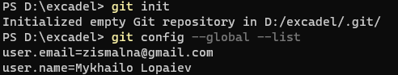
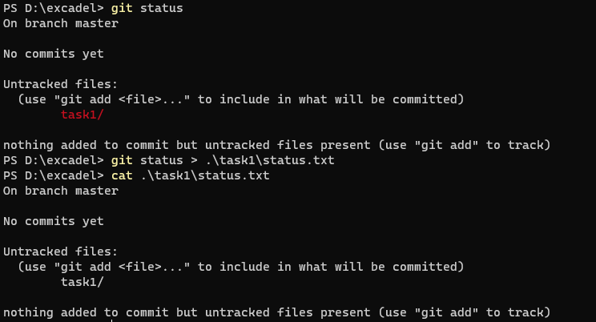
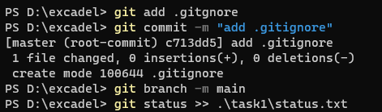
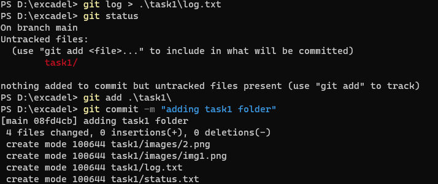

# Git

### Results of my work with git

Creating a new repository and verifying my global settings:

Checking repo status and adding output to *status.txt*:

Adding *.gitignore*, making a commit, and updating *status.txt*. Also, renaming *master* to *main* while at it:

Recording *log.txt* from the output of *git log* and adding remaining files:

