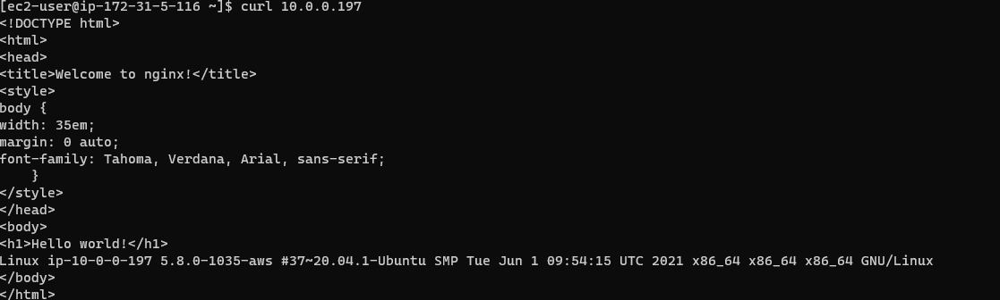
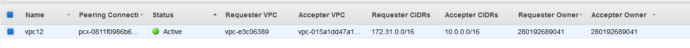

# AWS Cloud
## My web page - http://ec2-3-64-124-229.eu-central-1.compute.amazonaws.com/

Two EC2 instances remain: Amazon Linux 2 and Ubuntu Server.

### Access

SSH to my instances can be done to the following IPs:

```sh
3.64.124.229
3.123.127.35
```

SSH access is available only from my home IP address and between the instances. Additinally, the instances can communicate using both private and public IP addresses.

To be able to ping and ssh, I added inbound rules to respective security groups of both instances:

```sh
SSH	TCP	22	10.0.0.0/16	–
All ICMP - IPv4	ICMP	All	10.0.0.0/16	–
All ICMP - IPv4	ICMP	All	3.64.124.229/32	–
```

```sh
SSH	TCP	22	172.31.0.0/16	–
All ICMP - IPv4	ICMP	All	172.31.0.0/16	–
All ICMP - IPv4	ICMP	All	3.123.127.35/32	–
```

The Amazon Linux instance can also access webpage of Nginx installed on Ubuntu instance:



### Extra
The instances use 2 different VPCs.
Ubuntu instance has the private IP of 10.0.0.197/24, and Amazon Linux has the private IP of 172.31.5.116/20. To establish communication between private networks, I used VPC peering:



Additionally, I added routes to Route Tables for 172.31.0.0/16 and 10.0.0.0/16.

I wrote the following *bash* script to automate the installation:

```sh
#!bin/bash
apt-get update && apt-get -y upgrade
apt-get install -y nginx
opsys=$(uname -a)
indexpage=/var/www/html/index.nginx-debian.html
echo -e '<!DOCTYPE html>\n<html>\n<head>\n<title>Welcome to nginx!</title>\n<style>\nbody {\nwidth: 35em;\nmargin: 0 auto;\nfont-family: Tahoma, Verdana, Arial, sans-serif;\n    }\n</style>\n</head>\n<body>\n<h1>Hello world!</h1>' > $indexpage
echo "$opsys" >> $indexpage
echo -e '</body>\n</html>' >> $indexpage
```

Performing installation without ssh:

I used AWS Systems Manager, attaching the respective IAM role to one of my instances.

After that, the commands and scripts can be run via the SSM agent as follows:

AWS SSM:

```sh
aws ssm send-command --document-name "AWS-RunShellScript" --document-version "1" --targets '[{"Key":"InstanceIds","Values":["i-055b54e63ebf4cf90"]}]' --parameters '{"commands":["sudo bash task2.sh",""],"workingDirectory":["/home/ubuntu"],"executionTimeout":["360"]}' --timeout-seconds 600 --max-concurrency "50" --max-errors "0" --region eu-central-1
```


