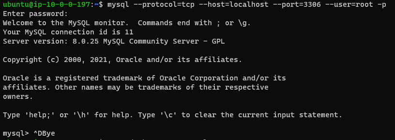

# Docker

### Installing Docker

Bash script for installing Docker on Ubuntu:

```sh
#!bin/bash
apt-get update
apt-get install -y apt-transport-https ca-certificates curl gnupg lsb-release
curl -fsSL https://download.docker.com/linux/ubuntu/gpg | sudo gpg --dearmor -o /usr/share/keyrings/docker-archive-keyring.gpg
echo \
  "deb [arch=amd64 signed-by=/usr/share/keyrings/docker-archive-keyring.gpg] https://download.docker.com/linux/ubuntu \
  $(lsb_release -cs) stable" | sudo tee /etc/apt/sources.list.d/docker.list > /dev/null
apt-get update
apt-get install -y docker-ce docker-ce-cli containerd.io
```

### Building Docker image from basic Ubuntu image

Creating dockerfile to build image:

```sh
FROM ubuntu:latest
ENV DEVOPS="mlopaiev"
ENV index="/var/www/html/index.nginx-debian.html"
RUN apt-get update && \
apt-get install -y nginx
COPY ./task3.sh /tmp
RUN bash /tmp/task3.sh
EXPOSE 80
STOPSIGNAL SIGQUIT
CMD tac $index | sed '3d' | tac > /tmp/test.html && mv /tmp/test.html $index && \
sed -i "14 a $MYNAME Sandbox 2021" $index && \
nginx -g 'daemon off;'
```

This way, when running *docker run*, and passing variable from host, it's updated in container and displayed on the web page:

```sh
 sudo docker build -t nginx ./
 
 sudo docker run --name test17 --env MYNAME="M.Lopayev" -d -p 80:80 nginx
```

The passed environmental variable is then seen on the web page, and is also updated when *docker run* passes another value for the variable *$MYNAME*.


### Pushing to Docker Hub

Logging to Docker Hub on host: 

```sh
sudo docker login docker.io
```

Applying tag and pushing:

```sh
sudo docker tag nginx:latest zismalna/devops:latest

sudo docker push zismalna/devops:latest
```


### Docker-compose

When applying

```sh
sudo docker-compose up -d --scale web=5
```

We spin 5 web instances, 1 db instance, and 1 java app instance, as per this docker-compose file:

```sh
services:

  db:
    env_file:
      - /home/ubuntu/db.env
    image: mysql:$TAG
    command: --default-authentication-plugin=mysql_native_password
    restart: always
    ports:
      - "3306:3306"

  web:
    env_file:
      - /home/ubuntu/web.env
    build: $DOCKERFILE
    ports:
      - "8080-8090:80"
  java:
    env_file:
      - /home/ubuntu/java.env
    image: milkyway/tomcat7-jre7
    depends_on:
      - $DEPENDENCY
    ports:
      - "8123:8080"
```

The instances:


.env files:

The .env file passes variables to *docker-compose.yml*, while *web.env*,. *db.env*, and *java.env* pass variables into containers built by *docker-compose*:

```sh
cat .env

TAG=latest
DOCKERFILE=/home/ubuntu
DEPENDENCY="db"

cat db.env
MYSQL_ROOT_PASSWORD=example

cat web.env
MYNAME="M.Lopayev"
```

Checking if variables are passed into containers:

MySQL containder:



Nginx container:


