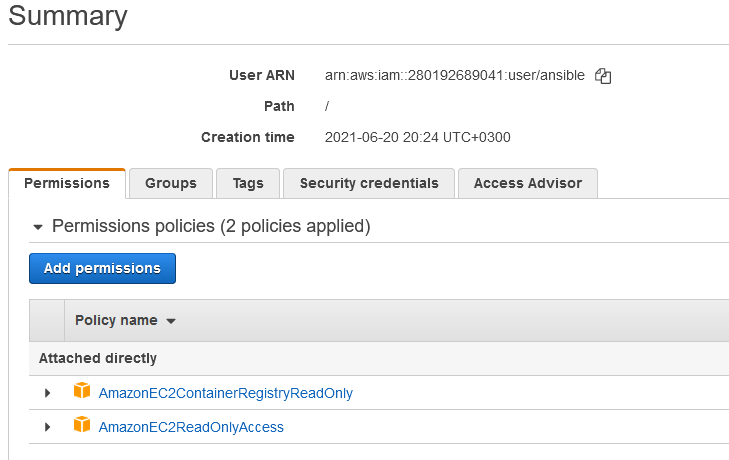
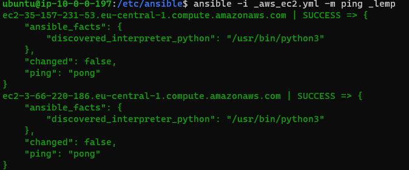
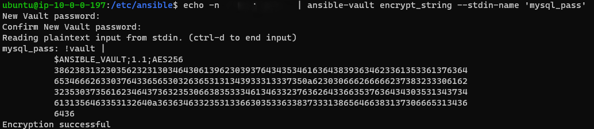
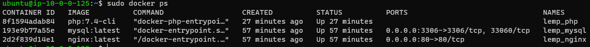

# Ansible for beginners 

Installing ansible:

```sh
sudo apt update
sudo apt install software-properties-common
sudo add-apt-repository --yes --update ppa:ansible/ansible
sudo apt install ansible
```

Installing *pip3* and *awscli*:

```sh
sudo apt install python3-pip
sudo apt install awscli
```

Adding IAM user and configuring aws profile on control plane:



```sh
aws configure --profile ansible
```

Editing *ansible.cfg*:

```sh
[defaults]
private_key_file = /home/ubuntu/instance1.pem
host_key_checking = False

[inventory]

enable_plugins = host_list, virtualbox, yaml, constructed, aws_ec2
```

Creating *.yml* file for dynamic inventory:

```sh
---
plugin: aws_ec2
boto_profile: ansible
regions:
  - eu-central-1
strict: False
keyed_groups:
  - key: tags.group
compose:
  ansible_host: ip_address
```

This searches for the tag "group" assigned to ec2 instances. I assigned 2 other instances tag "group" with the value "lemp".

Ping pong:




Setting up LEMP stack on ec2 instances:

```sh

---
- hosts: _lemp
  become: true
  vars:
    mysql_pass: !vault |
          $ANSIBLE_VAULT;1.1;AES256
          38623831323035623231303464306139623039376434353461636438393634623361353361376364
          6534666263303764336565303263653131343933313337350a623030666266666237383233306162
          32353037356162346437363235306638353334613463323763626433663537636434303531343734
          6131356463353132640a363634633235313366303533633837333138656466383137306665313436
          6436
  tasks:

    - name: Install prerequisites for Docker
      apt: name={{ item }} state=latest update-cache=yes
      loop: [ 'apt-transport-https', 'ca-certificates', 'curl', 'gnupg', 'lsb-release', 'python3-pip']

    - name: Add Docker GPG apt Key
      apt_key:
        url: https://download.docker.com/linux/ubuntu/gpg
        state: present

    - name: Add Docker Repository
      apt_repository:
        repo: deb https://download.docker.com/linux/ubuntu focal stable
        state: present

    - name: Install Docker
      apt: name={{ item }} state=latest update-cache=yes
      loop: [ 'docker-ce', 'docker-ce-cli', 'containerd.io']

    - name: Install Docker SDK
      pip:
        name: docker

    - name: Create an nginx container
      docker_container:
        name: lemp_nginx
        image: nginx:latest
        state: started
        published_ports:
          - 80:80

    - name: Create mysql container
      docker_container:
        name: lemp_mysql
        image: mysql:latest
        command: --default-authentication-plugin=mysql_native_password
        state: started
        published_ports:
          - 3306:3306
        env:
            MYSQL_ROOT_PASSWORD: "{{ mysql_pass }}"

    - name: Create php container
      docker_container:
        name: lemp_php
        image: php:7.4-cli
        state: started
        command: tail -f /dev/null
```

Here I used ansible-vault to encrypt password to MySQL database:



After applying the playbook on target host:

```sh
ubuntu@ip-10-0-0-197:/etc/ansible$ ansible-playbook -i _aws_ec2.yml task4.yml --ask-vault-pass
Vault password:

PLAY [_lemp] **************************************************************************************************************
TASK [Gathering Facts] ****************************************************************************************************ok: [ec2-35-157-231-53.eu-central-1.compute.amazonaws.com]
ok: [ec2-3-66-220-186.eu-central-1.compute.amazonaws.com]

TASK [Install prerequisites for Docker] ***********************************************************************************ok: [ec2-3-66-220-186.eu-central-1.compute.amazonaws.com] => (item=apt-transport-https)
ok: [ec2-35-157-231-53.eu-central-1.compute.amazonaws.com] => (item=apt-transport-https)
ok: [ec2-3-66-220-186.eu-central-1.compute.amazonaws.com] => (item=ca-certificates)
ok: [ec2-35-157-231-53.eu-central-1.compute.amazonaws.com] => (item=ca-certificates)
ok: [ec2-3-66-220-186.eu-central-1.compute.amazonaws.com] => (item=curl)
ok: [ec2-35-157-231-53.eu-central-1.compute.amazonaws.com] => (item=curl)
ok: [ec2-3-66-220-186.eu-central-1.compute.amazonaws.com] => (item=gnupg)
ok: [ec2-35-157-231-53.eu-central-1.compute.amazonaws.com] => (item=gnupg)
ok: [ec2-3-66-220-186.eu-central-1.compute.amazonaws.com] => (item=lsb-release)
ok: [ec2-35-157-231-53.eu-central-1.compute.amazonaws.com] => (item=lsb-release)
ok: [ec2-3-66-220-186.eu-central-1.compute.amazonaws.com] => (item=python3-pip)
ok: [ec2-35-157-231-53.eu-central-1.compute.amazonaws.com] => (item=python3-pip)

TASK [Add Docker GPG apt Key] *********************************************************************************************ok: [ec2-3-66-220-186.eu-central-1.compute.amazonaws.com]
ok: [ec2-35-157-231-53.eu-central-1.compute.amazonaws.com]

TASK [Add Docker Repository] **********************************************************************************************ok: [ec2-3-66-220-186.eu-central-1.compute.amazonaws.com]
ok: [ec2-35-157-231-53.eu-central-1.compute.amazonaws.com]

TASK [Install Docker] *****************************************************************************************************ok: [ec2-3-66-220-186.
ok: [ec2-3-66-220-186.eu-central-1.compute.amazonaws.com] => (item=docker-ce)
ok: [ec2-35-157-231-53.eu-central-1.compute.amazonaws.com] => (item=docker-ce)
ok: [ec2-3-66-220-186.eu-central-1.compute.amazonaws.com] => (item=docker-ce-cli)
ok: [ec2-35-157-231-53.eu-central-1.compute.amazonaws.com] => (item=docker-ce-cli)
ok: [ec2-3-66-220-186.eu-central-1.compute.amazonaws.com] => (item=containerd.io)
ok: [ec2-35-157-231-53.eu-central-1.compute.amazonaws.com] => (item=containerd.io)

TASK [Install Docker SDK] *************************************************************************************************ok: [ec2-35-157-231-53.eu-central-1.compute.amazonaws.com]
ok: [ec2-3-66-220-186.eu-central-1.compute.amazonaws.com]

TASK [Create an nginx container] ******************************************************************************************ok: [ec2-35-157-231-53.eu-central-1.compute.amazonaws.com]
ok: [ec2-3-66-220-186.eu-central-1.compute.amazonaws.com]

TASK [Create mysql container] *********************************************************************************************ok: [ec2-3-66-220-186.eu-central-1.compute.amazonaws.com]
ok: [ec2-35-157-231-53.eu-central-1.compute.amazonaws.com]

TASK [Create php container] ***********************************************************************************************changed: [ec2-35-157-231-53.eu-central-1.compute.amazonaws.com]
changed: [ec2-3-66-220-186.eu-central-1.compute.amazonaws.com]

PLAY RECAP ****************************************************************************************************************ec2-3-66-220-186.eu-central-1.compute.amazonaws.com : ok=9    changed=1    unreachable=0    failed=0    skipped=0    rescued=0    ignored=0
ec2-35-157-231-53.eu-central-1.compute.amazonaws.com : ok=9    changed=1    unreachable=0    failed=0    skipped=0    rescued=0    ignored=0
```

Containers of target host:




