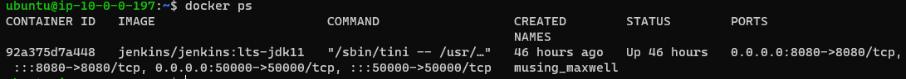
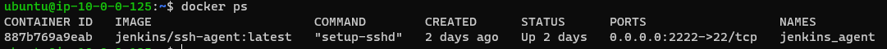
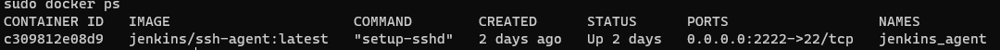
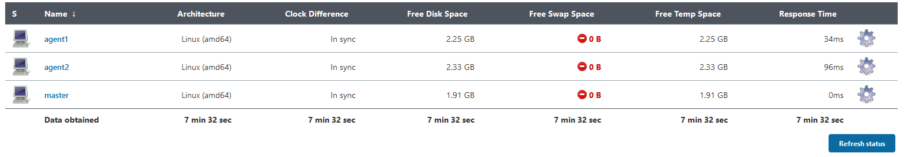
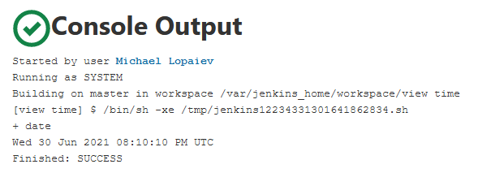
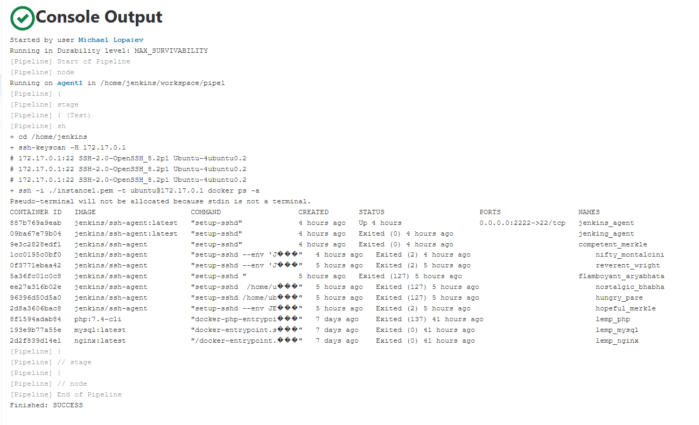
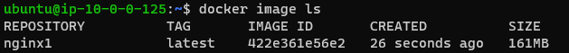
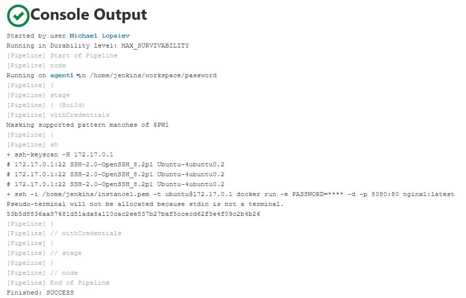
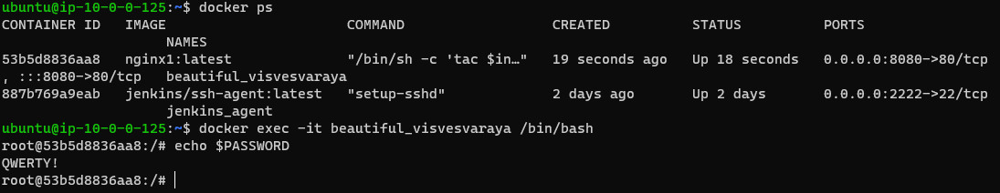
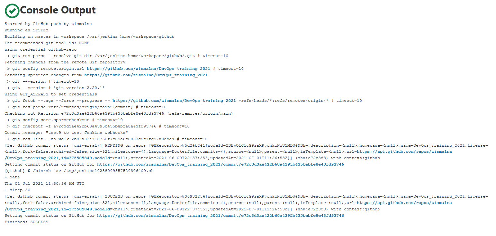

# Jenkins

### Setting up Jenkins in Docker

```sh
docker ps
```



### Jenkins agents

Jenkins agents are set up on separate Amazon instances as Docker containers:







### Freestyle project

Displays current time:



### Pipeline #1

A Jenkins pipeline that performs *docker ps -a* on a host that runs Jenkins agent in Docker.

```sh
pipeline {
    agent {
        node {
            label 'ubuntu1'
        }
        } 
    stages {
        stage('Test') {
            steps {
                sh '''cd /home/jenkins
                ssh-keyscan -H 172.17.0.1 >> ~/.ssh/known_hosts
                ssh -i ./instance1.pem -t ubuntu@172.17.0.1 docker ps -a'''
            }
            }
        }
    }
```

Result:



### Building docker image from my Github

After adding credentials in Jenkins Credentials Manager:

The pipeline:

```sh
pipeline {
    agent {
        node {
            label 'ubuntu1'
        }
        } 
    stages {
        stage('Get code') {
            steps {
                // Get some code from a GitHub repository
                git branch: 'main', credentialsId: 'github-repo', url: 'https://github.com/zismalna/DevOps_training_2021/'
                }
        }
        stage('Build') {
            steps {
                sh '''ssh-keyscan -H 172.17.0.1 >> ~/.ssh/known_hosts
                scp -i ~/instance1.pem ./task3/Dockerfile ubuntu@172.17.0.1:/home/ubuntu 
                ssh -i ~/instance1.pem -t ubuntu@172.17.0.1 build -t nginx /home/ubuntu/'''
                }
            }
        }
    }
```

Result:

```sh

Started by user Michael Lopaiev
Running in Durability level: MAX_SURVIVABILITY
[Pipeline] Start of Pipeline
[Pipeline] node
Running on agent1 in /home/jenkins/workspace/Git
[Pipeline] {
[Pipeline] stage
[Pipeline] { (Get code)
[Pipeline] git
The recommended git tool is: NONE
using credential github-repo
Fetching changes from the remote Git repository
Checking out Revision 1290aea894929f64210c3d288ce5374be2908e1e (refs/remotes/origin/main)
Commit message: "Committig modified Dockerfile from task3"
 > git rev-parse --resolve-git-dir /home/jenkins/workspace/Git/.git # timeout=10
 > git config remote.origin.url https://github.com/zismalna/DevOps_training_2021/ # timeout=10
Fetching upstream changes from https://github.com/zismalna/DevOps_training_2021/
 > git --version # timeout=10
 > git --version # 'git version 2.20.1'
using GIT_ASKPASS to set credentials 
 > git fetch --tags --force --progress -- https://github.com/zismalna/DevOps_training_2021/ +refs/heads/*:refs/remotes/origin/* # timeout=10
 > git rev-parse refs/remotes/origin/main^{commit} # timeout=10
 > git config core.sparsecheckout # timeout=10
 > git checkout -f 1290aea894929f64210c3d288ce5374be2908e1e # timeout=10
 > git branch -a -v --no-abbrev # timeout=10
 > git branch -D main # timeout=10
 > git checkout -b main 1290aea894929f64210c3d288ce5374be2908e1e # timeout=10
 > git rev-list --no-walk 1290aea894929f64210c3d288ce5374be2908e1e # timeout=10
[Pipeline] }
[Pipeline] // stage
[Pipeline] stage
[Pipeline] { (Build)
[Pipeline] sh
+ ssh-keyscan -H 172.17.0.1
# 172.17.0.1:22 SSH-2.0-OpenSSH_8.2p1 Ubuntu-4ubuntu0.2
# 172.17.0.1:22 SSH-2.0-OpenSSH_8.2p1 Ubuntu-4ubuntu0.2
# 172.17.0.1:22 SSH-2.0-OpenSSH_8.2p1 Ubuntu-4ubuntu0.2
+ scp -i /home/jenkins/instance1.pem ./task5/Dockerfile ubuntu@172.17.0.1:/home/ubuntu
+ ssh -i /home/jenkins/instance1.pem -t ubuntu@172.17.0.1 docker build -t nginx1 /home/ubuntu/
Pseudo-terminal will not be allocated because stdin is not a terminal.
Sending build context to Docker daemon  22.53kB

Step 1/7 : FROM ubuntu:latest
 ---> 9873176a8ff5
Step 2/7 : ENV DEVOPS="mlopaiev"
 ---> Using cache
 ---> 8f1063f6f1db
Step 3/7 : ENV index="/var/www/html/index.nginx-debian.html"
 ---> Using cache
 ---> 31b161b12f88
Step 4/7 : RUN apt-get update && apt-get install -y nginx
 ---> Using cache
 ---> c1e473efd52a
Step 5/7 : EXPOSE 80
 ---> Using cache
 ---> 8fb62e1d3384
Step 6/7 : STOPSIGNAL SIGQUIT
 ---> Using cache
 ---> ccb7c9b14b6a
Step 7/7 : CMD tac $index | sed '3d' | tac > /tmp/test.html && mv /tmp/test.html $index && sed -i "14 a $MYNAME Sandbox 2021" $index && nginx -g 'daemon off;'
 ---> Using cache
 ---> 422e361e56e2
Successfully built 422e361e56e2
Successfully tagged nginx1:latest
[Pipeline] }
[Pipeline] // stage
[Pipeline] }
[Pipeline] // node
[Pipeline] End of Pipeline
Finished: SUCCESS
```

Resulting docker image:




### Passing environment variable to Docker container

After adding credential *PASSWORD* to Jenkins Credentials Manager:

```sh
pipeline {
    agent {
        node {
            label 'ubuntu1'
        }
        } 
    stages {
        stage('Build') {
			    steps {
				withCredentials([string(credentialsId: 'PASSWORD', variable: 'PW1')]) {
                sh '''ssh-keyscan -H 172.17.0.1 >> ~/.ssh/known_hosts
                ssh -i ~/instance1.pem -t ubuntu@172.17.0.1 docker run -e PASSWORD="$PW1" -d -p 8080:80 nginx1:latest'''
				}
                }
            }
        }
    }
```

Result:



Checking variable in container:




### Ansible script that deploys Jenkins

```sh
---
- hosts: _lemp
  become: true
  vars:
    ssh_pub: !vault |
          $ANSIBLE_VAULT;1.1;AES256
          66316663353063623064626336343465363831643930343731316463373236316262646435353162
          3063623739366431356532343636383262353863663634640a323561636532626661626337653962
          32643731303333313931306432303231623333663163393134383762636438303337333363363362
          6332626662353531360a303534323737666431666336353364633735323935383137653662313030
          65633566353630626331623262326333623435383135386530653233363439323932666161353061
          63386564376535313935396336613164306532363137396662366163633962346262636437666266
          33383231356433343136323033363365396239316530633664626130666330646263656136346565
          64643563393533373665386539633965333663636164356361396130306330616234623539313933
          61643061663134636437333232333939656665623330336539326135356566393236616537316136
          61343333306364663532393766336464323061383439303361346666623663306136383539666337
          33633566313264353533333363336232313766386534653635376130383561663836353164353838
          34326639656633313664653361643037363164346236303363353936643934656537376230393339
          38353334303031333232643135333838313062356530343362643861623262303333326664323031
          39633165613465656635643336313537616535666662646233376131396238343262663239313564
          37643766303833626163363130396561383964346163646133653166666633313964636535643630
          66363331653535613133623032663865323530366632393834333438646335336530636463373835
          36396332366331383534353261633563376663303737396631333337646335376230353862346134
          38393164383438313863663237393061373033323935626133336562656238353733636239303231
          63396236633863653832343132396465643530383034356232636231613335396235346564366537
          33346531626366623336626535336434623230356564656131623137306634636633363737653836
          39366138316630353134613262623663363865376530663336613033323762353638623133313466
          37643332663861393662613366363363656263376562633864363064653931656663393232346537
          34666539383766356131366561303834653532666362343033326461373932653032306439376266
          61333364383234623435366537636230343063333664323164393931636433613462313762303635
          33326138326530393536636533373965613036646363326564396338383435393963393838366230
          34373338303263373265396461633961663139336462306331616364366239333933636530383736
          31346166346331643935313539323238333434343439373632623661336136393035636337633931
          35346336333737643234653566353465306330363332386330373063316235326661343366623136
          33623965613461326435306430346135303938363939646162356534623563623536313666653238
          34366335343264356434643230646234393765646137613338326261383933643561386266316463
          33346537343262656532623633373662333736663033386166353330313936393566343836336464
          39323335393861623264
  tasks:

    - name: Install prerequisites for Docker
      apt: name={{ item }} state=latest update-cache=yes
      loop: [ 'apt-transport-https', 'ca-certificates', 'curl', 'gnupg', 'lsb-release', 'python3-pip']

    - name: Add Docker GPG apt Key
      apt_key:
        url: https://download.docker.com/linux/ubuntu/gpg
        state: present

    - name: Add Docker Repository
      apt_repository:
        repo: deb https://download.docker.com/linux/ubuntu focal stable
        state: present

    - name: Install Docker
      apt: name={{ item }} state=latest update-cache=yes
      loop: [ 'docker-ce', 'docker-ce-cli', 'containerd.io']

    - name: Install Docker SDK
      pip:
        name: docker

    - name: Create jenkins-agent container
      docker_container:
        name: jenkins_agent
        image: jenkins/ssh-agent:latest
        state: started
        published_ports:
          - 2222:22
        env:
            JENKINS_AGENT_SSH_PUBKEY: "{{ ssh_pub }}"
    
    - name: Setup Jenkins agent variables
      shell: VARS1="HOME=|USER=|MAIL=|LC_ALL=|LS_COLORS=|LANG=" && VARS2="HOSTNAME=|PWD=|TERM=|SHLVL=|LANGUAGE=|_=" && VARS="${VARS1}|${VARS2}" && docker exec jenkins_agent sh -c "env | egrep -v '^(${VARS})' >> /etc/environment"
      
    - name: Copy ssh key to hosts
      copy:
        src: /home/ubuntu/instance1.pem
        dest: /home/ubuntu/instance1.pem
        mode: 0644
        
    - name: Copy ssh key to Docker container
      command: docker cp /home/ubuntu/instance1.pem jenkins_agent:/home/jenkins
```

### Docker registry on remote host:

This pipeline sets up docker registry, pushes docker image to the registry, pulls it back, and runs docker container:

```sh
pipeline {
    agent {
        node {
            label 'ubuntu1'
        }
        } 
    stages {
        stage('Build') {
            steps {
                sh '''ssh-keyscan -H 172.17.0.1 >> ~/.ssh/known_hosts
                ssh -i ~/instance1.pem -t ubuntu@172.17.0.1 docker run -d -p 5000:5000 --restart=always --name doc_rep registry:2
				'''
		stage('pull test image'){
            steps{
                sh'''
                    ssh -i ~/instance1.pem -t ubuntu@172.17.0.1 docker pull hello-world
                '''
            }
        }
        stage('push to local repository'){
            steps{
                sh'''
                    ssh -i ~/instance1.pem -t ubuntu@172.17.0.1 docker tag hello-world localhost:5000/my-hello-world
                    ssh -i ~/instance1.pem -t ubuntu@172.17.0.1 docker push localhost:5000/my-hello-world
                    ssh -i ~/instance1.pem -t ubuntu@172.17.0.1 docker image remove hello-world
                    ssh -i ~/instance1.pem -t ubuntu@172.17.0.1 docker image remove localhost:5000/my-hello-world
                '''
            }
        }
        stage('pull from local repository'){
            steps{
                sh'''
                    ssh -i ~/instance1.pem -t ubuntu@172.17.0.1 docker pull localhost:5000/my-hello-world
                    ssh -i ~/instance1.pem -t ubuntu@172.17.0.1 docker images
                '''
            }
        }
        stage('deploy test image'){
            steps{
                sh'''
                    ssh -i ~/instance1.pem -t ubuntu@172.17.0.1 docker run -d --name helloworld1 localhost:5000/my-hello-world
                '''
            }
        }
    }
}
```

Jenkins console output:

```sh
Started by user Michael Lopaiev
Running in Durability level: MAX_SURVIVABILITY
[Pipeline] Start of Pipeline
[Pipeline] node
Running on agent1 in /home/jenkins/workspace/docker registry
[Pipeline] {
[Pipeline] stage
[Pipeline] { (Build)
[Pipeline] sh
+ ssh-keyscan -H 172.17.0.1
# 172.17.0.1:22 SSH-2.0-OpenSSH_8.2p1 Ubuntu-4ubuntu0.2
# 172.17.0.1:22 SSH-2.0-OpenSSH_8.2p1 Ubuntu-4ubuntu0.2
# 172.17.0.1:22 SSH-2.0-OpenSSH_8.2p1 Ubuntu-4ubuntu0.2
+ ssh -i /home/jenkins/instance1.pem -t ubuntu@172.17.0.1 docker run -d -p 5000:5000 --restart=always --name doc_rep registry:2
Pseudo-terminal will not be allocated because stdin is not a terminal.
Unable to find image 'registry:2' locally
2: Pulling from library/registry
ddad3d7c1e96: Pulling fs layer
6eda6749503f: Pulling fs layer
363ab70c2143: Pulling fs layer
5b94580856e6: Pulling fs layer
12008541203a: Pulling fs layer
5b94580856e6: Waiting
12008541203a: Waiting
6eda6749503f: Verifying Checksum
6eda6749503f: Download complete
ddad3d7c1e96: Verifying Checksum
ddad3d7c1e96: Download complete
363ab70c2143: Verifying Checksum
363ab70c2143: Download complete
5b94580856e6: Verifying Checksum
5b94580856e6: Download complete
12008541203a: Verifying Checksum
12008541203a: Download complete
ddad3d7c1e96: Pull complete
6eda6749503f: Pull complete
363ab70c2143: Pull complete
5b94580856e6: Pull complete
12008541203a: Pull complete
Digest: sha256:aba2bfe9f0cff1ac0618ec4a54bfefb2e685bbac67c8ebaf3b6405929b3e616f
Status: Downloaded newer image for registry:2
49f4af63495a832f87051e3e996555b86d06159f348b10e93931343a0141a974
[Pipeline] }
[Pipeline] // stage
[Pipeline] stage
[Pipeline] { (pull test image)
[Pipeline] sh
+ ssh -i /home/jenkins/instance1.pem -t ubuntu@172.17.0.1 docker pull hello-world
Pseudo-terminal will not be allocated because stdin is not a terminal.
Using default tag: latest
latest: Pulling from library/hello-world
b8dfde127a29: Pulling fs layer
b8dfde127a29: Verifying Checksum
b8dfde127a29: Download complete
b8dfde127a29: Pull complete
Digest: sha256:9f6ad537c5132bcce57f7a0a20e317228d382c3cd61edae14650eec68b2b345c
Status: Downloaded newer image for hello-world:latest
docker.io/library/hello-world:latest
[Pipeline] }
[Pipeline] // stage
[Pipeline] stage
[Pipeline] { (push to local repository)
[Pipeline] sh
+ ssh -i /home/jenkins/instance1.pem -t ubuntu@172.17.0.1 docker tag hello-world localhost:5000/my-hello-world
Pseudo-terminal will not be allocated because stdin is not a terminal.
+ ssh -i /home/jenkins/instance1.pem -t ubuntu@172.17.0.1 docker push localhost:5000/my-hello-world
Pseudo-terminal will not be allocated because stdin is not a terminal.
Using default tag: latest
The push refers to repository [localhost:5000/my-hello-world]
f22b99068db9: Preparing
f22b99068db9: Pushed
latest: digest: sha256:1b26826f602946860c279fce658f31050cff2c596583af237d971f4629b57792 size: 525
+ ssh -i /home/jenkins/instance1.pem -t ubuntu@172.17.0.1 docker image remove hello-world
Pseudo-terminal will not be allocated because stdin is not a terminal.
Untagged: hello-world:latest
Untagged: hello-world@sha256:9f6ad537c5132bcce57f7a0a20e317228d382c3cd61edae14650eec68b2b345c
+ ssh -i /home/jenkins/instance1.pem -t ubuntu@172.17.0.1 docker image remove localhost:5000/my-hello-world
Pseudo-terminal will not be allocated because stdin is not a terminal.
Untagged: localhost:5000/my-hello-world:latest
Untagged: localhost:5000/my-hello-world@sha256:1b26826f602946860c279fce658f31050cff2c596583af237d971f4629b57792
Deleted: sha256:d1165f2212346b2bab48cb01c1e39ee8ad1be46b87873d9ca7a4e434980a7726
Deleted: sha256:f22b99068db93900abe17f7f5e09ec775c2826ecfe9db961fea68293744144bd
[Pipeline] }
[Pipeline] // stage
[Pipeline] stage
[Pipeline] { (pull from local repository)
[Pipeline] sh
+ ssh -i /home/jenkins/instance1.pem -t ubuntu@172.17.0.1 docker pull localhost:5000/my-hello-world
Pseudo-terminal will not be allocated because stdin is not a terminal.
Using default tag: latest
latest: Pulling from my-hello-world
b8dfde127a29: Pulling fs layer
b8dfde127a29: Verifying Checksum
b8dfde127a29: Download complete
b8dfde127a29: Pull complete
Digest: sha256:1b26826f602946860c279fce658f31050cff2c596583af237d971f4629b57792
Status: Downloaded newer image for localhost:5000/my-hello-world:latest
localhost:5000/my-hello-world:latest
+ ssh -i /home/jenkins/instance1.pem -t ubuntu@172.17.0.1 docker images
Pseudo-terminal will not be allocated because stdin is not a terminal.
REPOSITORY                      TAG       IMAGE ID       CREATED        SIZE
nginx1                          latest    422e361e56e2   2 days ago     161MB
ubuntu                          latest    9873176a8ff5   13 days ago    72.7MB
php                             7.4-cli   3f13ef15ce95   3 weeks ago    420MB
nginx                           latest    d1a364dc548d   5 weeks ago    133MB
mysql                           latest    c0cdc95609f1   7 weeks ago    556MB
registry                        2         1fd8e1b0bb7e   2 months ago   26.2MB
localhost:5000/my-hello-world   latest    d1165f221234   3 months ago   13.3kB
jenkins/ssh-agent               latest    30c405b39b48   4 months ago   518MB
[Pipeline] }
[Pipeline] // stage
[Pipeline] stage
[Pipeline] { (deploy test image)
[Pipeline] sh
+ ssh -i /home/jenkins/instance1.pem -t ubuntu@172.17.0.1 docker run -d --name helloworld1 localhost:5000/my-hello-world
Pseudo-terminal will not be allocated because stdin is not a terminal.
6c3833cbbba6ea7503065493c9362821cb0c46bafb768d674553bc48a4455ade
[Pipeline] }
[Pipeline] // stage
[Pipeline] }
[Pipeline] // node
[Pipeline] End of Pipeline
Finished: SUCCESS
```

### Jenkins and Github

1. Added webhook for GitHub
2. Generated token
3. Added token to Jenkins
4. Configured Jenkins job

Result:



