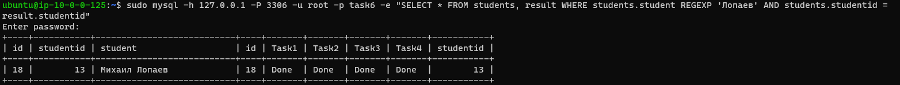
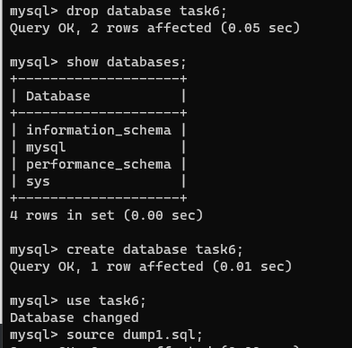

# Databases

Running MySQL in Docker with credentials stored in *.env* file:

```sh
docker run --name task6-mysql -v ~/datadir:/var/lib/mysql --env-file mysql.env -d -p 3306:3306 mysql:latest
```sh

After creating database *task6*, let us create the tables:

```sh
CREATE TABLE students (
id INT NOT NULL,
studentid INT NOT NULL AUTO_INCREMENT,
student VARCHAR(255) NOT NULL,
PRIMARY KEY (studentid)
 );
``` 
 
Allowing data import from *.csv*:
 
```sh 
SET GLOBAL local_infile=1;
 
mysql --local-infile=1 -u root -p
```

Importing date from *.csv* file:
 
```sh 
LOAD DATA LOCAL INFILE '/var/lib/mysql/L_O_S.csv'
INTO TABLE students
FIELDS TERMINATED BY ','
LINES TERMINATED BY '\n'
IGNORE 1 ROWS (id, student);
```

Creating table *result* with foreign key that references table *students*:

```sh
CREATE TABLE result (
id int NOT NULL AUTO_INCREMENT,
Task1 VARCHAR(255) NOT NULL,
Task2 VARCHAR(255) NOT NULL,
Task3 VARCHAR(255) NOT NULL,
Task4 VARCHAR(255) NOT NULL,
studentid INT NOT NULL,
FOREIGN KEY (studentid) REFERENCES students(studentid),
PRIMARY KEY (id)
 );

LOAD DATA LOCAL INFILE '/var/lib/mysql/L_O_S.csv'
INTO TABLE result
FIELDS TERMINATED BY ','
LINES TERMINATED BY '\n'
IGNORE 1 ROWS
(@id, @student, @Task1, @Task2, @Task3, @Task4)
set id=@id, Task1=@Task1, Task2=@Task2, Task3=@Task3, Task4=@Task4;
```

Populating result.studentid:

```sh
UPDATE result INNER JOIN students ON result.id = students.id SET result.studentid = students.studentid WHERE result.id = students.id;
```

Querying database for my results by surname:




### Making backup, deleting a database, and restoring it

```sh
mysqldump --databases networking > dump1.sql
```




### Script for populating database

This script populated database by creating two temporary tables, importing data to them from *.csv* file, and then populating main tables with the rows not already present in them.
Then temporary tables are dropped.

```sh
USE task6;

CREATE TABLE IF NOT EXISTS students_tmp (
id INT NOT NULL,
studentid INT NOT NULL AUTO_INCREMENT,
student VARCHAR(255) NOT NULL,
PRIMARY KEY (studentid)
 );
 
LOAD DATA LOCAL INFILE '/var/lib/mysql/L_O_S.csv'
INTO TABLE students_tmp
FIELDS TERMINATED BY ','
LINES TERMINATED BY '\n'
IGNORE 1 ROWS (id, student);

CREATE TABLE IF NOT EXISTS result_tmp (
id int NOT NULL AUTO_INCREMENT,
Task1 VARCHAR(255) NOT NULL,
Task2 VARCHAR(255) NOT NULL,
Task3 VARCHAR(255) NOT NULL,
Task4 VARCHAR(255) NOT NULL,
studentid INT NOT NULL,
FOREIGN KEY (studentid) REFERENCES students_tmp(studentid),
PRIMARY KEY (id)
 );
 
SET foreign_key_checks = 0;
 
LOAD DATA LOCAL INFILE '/var/lib/mysql/L_O_S.csv'
INTO TABLE result_tmp
FIELDS TERMINATED BY ','
LINES TERMINATED BY '\n'
IGNORE 1 ROWS
(@id, @student, @Task1, @Task2, @Task3, @Task4)
set id=@id, Task1=@Task1, Task2=@Task2, Task3=@Task3, Task4=@Task4;


CREATE TABLE IF NOT EXISTS students (
id INT NOT NULL,
studentid INT NOT NULL AUTO_INCREMENT,
student VARCHAR(255) NOT NULL,
PRIMARY KEY (studentid)
 );
 
CREATE TABLE IF NOT EXISTS result (
id int NOT NULL AUTO_INCREMENT,
Task1 VARCHAR(255) NOT NULL,
Task2 VARCHAR(255) NOT NULL,
Task3 VARCHAR(255) NOT NULL,
Task4 VARCHAR(255) NOT NULL,
studentid INT NOT NULL,
FOREIGN KEY (studentid) REFERENCES students(studentid),
PRIMARY KEY (id)
 );
 
INSERT into students (student, studentid) SELECT student,studentid FROM students_tmp WHERE students_tmp.studentid NOT IN (SELECT studentid FROM students);
INSERT into result (studentid,Task1,Task2,Task3,Task4) SELECT studentid,Task1,Task2,Task3,Task4 FROM result_tmp WHERE result_tmp.studentid NOT IN (SELECT studentid from result);

SET foreign_key_checks = 1;

DROP TABLE result_tmp;  
DROP TABLE students_tmp;
```


### Ansible playbook te set up MySQL and restore databases from dump file:

```sh
- hosts: _lemp
  become: true
  vars:
    mysql_pass: !vault |
          $ANSIBLE_VAULT;1.1;AES256
          38623831323035623231303464306139623039376434353461636438393634623361353361376364
          6534666263303764336565303263653131343933313337350a623030666266666237383233306162
          32353037356162346437363235306638353334613463323763626433663537636434303531343734
          6131356463353132640a363634633235313366303533633837333138656466383137306665313436
          6436
  tasks:

    - name: Install prerequisites for Docker
      apt: name={{ item }} state=latest update-cache=yes
      loop: [ 'apt-transport-https', 'ca-certificates', 'curl', 'gnupg', 'lsb-release', 'python3-pip']

    - name: Add Docker GPG apt Key
      apt_key:
        url: https://download.docker.com/linux/ubuntu/gpg
        state: present

    - name: Add Docker Repository
      apt_repository:
        repo: deb https://download.docker.com/linux/ubuntu focal stable
        state: present

    - name: Install Docker
      apt: name={{ item }} state=latest update-cache=yes
      loop: [ 'docker-ce', 'docker-ce-cli', 'containerd.io']

    - name: Install Docker SDK
      pip:
        name: docker

    - name: Create mysql container
      docker_container:
        name: mysql_task6
        image: mysql:latest
        command: --default-authentication-plugin=mysql_native_password
        state: started
        published_ports:
          - 3306:3306
        env:
            MYSQL_ROOT_PASSWORD: "{{ mysql_pass }}"
    
    - name: Copy dump file to hosts
      copy:
        src: /home/ubuntu/dump1.sql
        dest: /home/ubuntu/dump1.sql        
        
    - name: Copy ssh key to Docker container
      command: docker cp /home/ubuntu/dump1.sql mysql_task6:/home/jenkins
	
    - name: Restore database from dump
      command: docker exec -i mysql_task6 sh -c 'exec mysql -u root -p "{{ mysql_pass }}"' < /home/ubuntu/dump1.sql
```